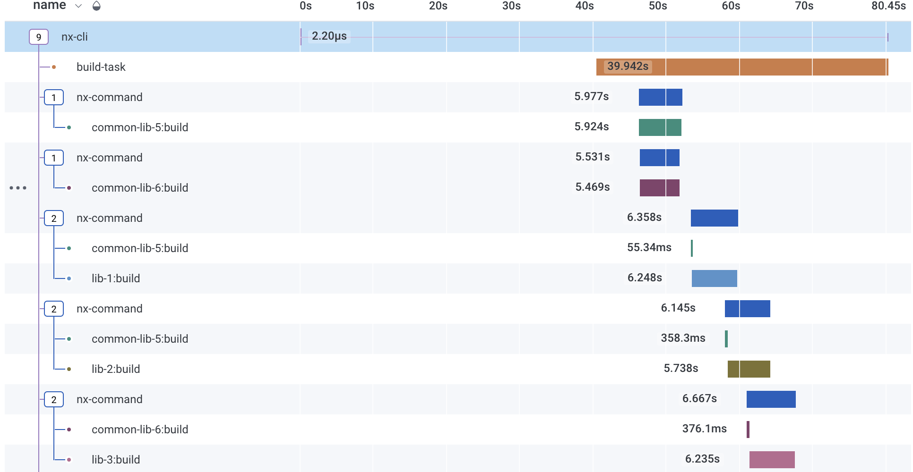

# @nxpansion/opentelemetry-tasks-runner

One of the best ways to improve you CI process is to instrument your CI pipeline. Libraries such as Honeycomb's [buildevents](https://github.com/honeycombio/buildevents) and [otel-cli](https://github.com/equinix-labs/otel-cli) have been great steps towards instrumenting CI pipelines. For people who use the [Nx Build Framework](https://nx.dev/), this library will automatically instrument all commands executed through the Nx CLI, removing the need for much of the manual work required to set up other tools.



This library exports an [Nx Tasks Runner](https://nx.dev/l/r/core-concepts/configuration#tasks-runner-options) that allows you to wrap an existing tasks runner. By wrapping the default Nx tasks runner such as `@nrwl/workspace/tasks-runners/default` or `@nrwl/nx-cloud`, this runner will create a span for each task that is ran through the Nx CLI.

By default, the runner can export these spans to either the console or to an OpenTelemetry Collector via OTLP (gRPC). These configurations can be overridden via a setup file in which any custom `NodeSdk` can be initiated, allowing custom exporters and processors to be used.

## Setup

To setup the tasks runner, add the below configuration your `nx.json` file.

```json
{
  "tasksRunnerOptions": {
    "default": {...},
    "otel": {
      "runner": "@nxpansion/opentelemetry-nx-runner",
      "options": {
        "wrappedTasksRunner": "@nrwl/workspace/tasks-runners/default",
        "wrappedTasksRunnerOptions": {
          "cacheableOperations": ["build", "lint", "test", "e2e"]
        },
        "exporter": "otlp-grpc",
        "otlpOptions": {
          "url": "grpc://localhost:4317"
        }
      }
    }
  }
}
```

You can execute an Nx run command with this runner by including the `--runner=otel` option. If you want all tasks to always be instrumented, you can replace the default tasks runner options instead of adding a second runner configuration.

## Compatible Versions

As `nx` has been updating and moving its internal tasks runner implementation, version `0.1.0` of the `@nxpansion/opentelemetry-tasks-runner` is currently only supporting ~13.10.0 versions of `nx`. Version 14 is close on the horizon and Nx roadmaps/source code docs imply that version 15 will reach a more stable tasks runner API. As the implementation stabilizes we will aim support a wider range of `nx` versions.

## Configuration

The `@nxpansion/opentelemetry-tasks-runner` supports the following configurations:

- `wrappedTasksRunner`: The tasks runner to instrument. At some level the tasks runner must use the default nx tasks runner to execute tasks. The `@nrwl/workspace/tasks-runners/default` and `@nrwl/nx-cloud` tasks runners both are supported.
- `wrappedTasksRunnerOptions`: These options will be passed to the wrapped tasks runner.
- `exporter`: Optional, `otlp-grpc`, `otlp-http` or `console`. The otlp uses gRPC to send traces via the OpenTelemetry Protocol. Defaults to `otlp-grpc`
- `otlpOptions`: Optional. If using the OTLP exporter, you can provide any options as defined by the `@opentelemetry/exporter-trace-otlp-grpc` `OTLPTraceExporter` here.
- `setupFile`: Optional. [See documentation](#setup-file) on the setup file.

### Setup File

In many cases, custom exporters and processors will need to deliver the spans to the platform of your choice. The setup file allows you to setup a custom OpenTelemetry `NodeSdk`. The file must export a default function which returns the `NodeSdk`. The function will also receive the default sdk options and the tasks runner configuration as arguments. Linked is an [example of configuring the tasks runner to send traces directly to honeycomb.io](example/example-honeycomb-setup.js). Additionally, you can also provide custom context. If provided, the span for the executed command with be created under the given context. The exported function should match the below function definition.

```ts
type OpenTelemetrySetupFunction = (
  defaultConfiguration: Partial<NodeSDKConfiguration>,
  tasks: Task[],
  options: OpentelemetryTasksRunnerOptions,
  context?: TasksRunnerContext
) => { sdk: NodeSdk; context?: OpenTelemetryContext };
```

## Context Propagation

It is quite possible that the Nx Command you are running should be instrumented within an existing trace. Using W3C Trace Context, we can pass that context to the tasks runner by setting the `TRACEPARENT` environment variable.

```
TRACEPARENT=00-0af7651916cd43dd8448eb211c80319c-b7ad6b7169203331-01 npx nx run app:build --runner=otel
```

Additionally, the tasks runner sets the `traceParent` option child tasks that are executed by the runner. Your executor can use this option if like to add instrumentation within the task. This is similar to passing the trace parent as an override option below

```

npx nx run app:build --runner=otel --traceParent=00-0af7651916cd43dd8448eb211c80319c-b7ad6b7169203331-01
```

```

## Running unit tests

Run `nx test opentelemetry-tasks-runner` to execute the tests via [Jest](https://jestjs.io).
```
